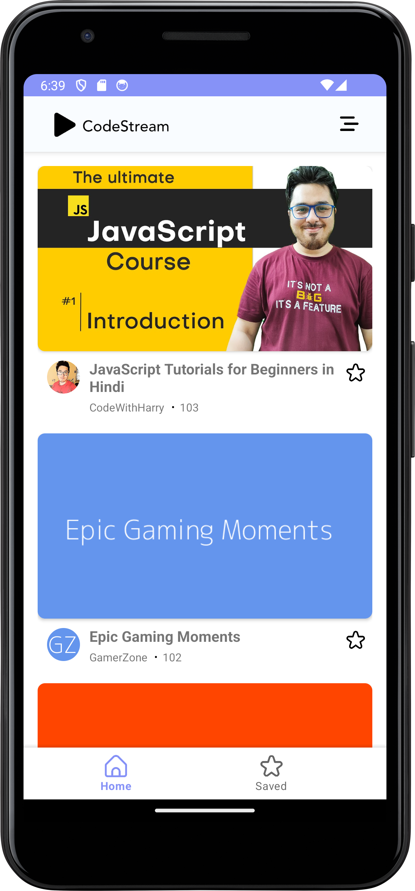
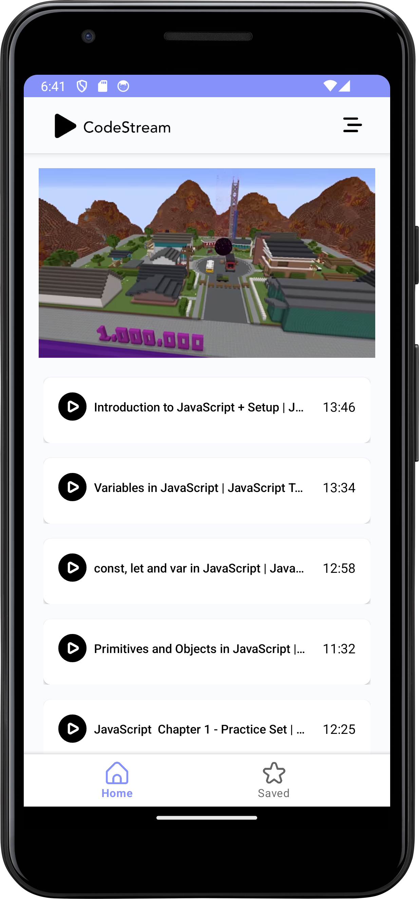

# CodeStream

CodeStream is an Android application designed to provide free coding courses to users of all skill levels. Whether you're a beginner looking to learn the basics or an experienced programmer aiming to sharpen your skills, CodeStream offers a wide range of courses to help you achieve your coding goals.

## Screenshots

<p align="center">
  
  
</p>

## Contributing

We welcome contributions from the community! If you would like to contribute to CodeStream, please follow these steps:

1. Fork the repository.
2. Create a new branch (`git checkout -b feature/YourFeature`).
3. Make your changes and commit them (`git commit -m 'Add some feature'`).
4. Push to the branch (`git push origin feature/YourFeature`).
5. Open a pull request.

## API 
```https://codestreamserver.onrender.com/playlist?playlist_id=PLu0W_9lII9ahR1blWXxgSlL4y9iQBnLpR```

## Contact

If you have any questions, suggestions, or feedback, please feel free to contact us at whatsapp 749-949-1002.
